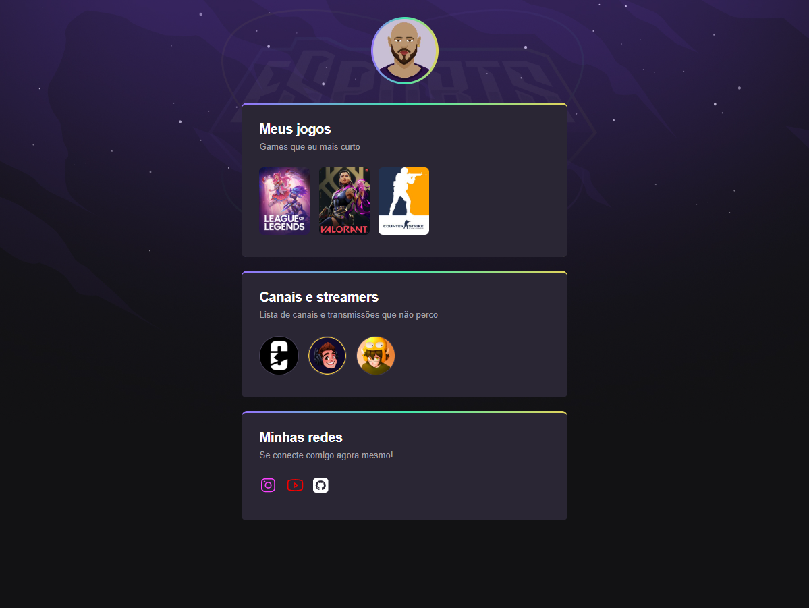

# NLW_eSports - Trilha Explorer

Descrição: uma página web pessoal que apresente os jogos e streamers preferidos além dos
canais para comunicação com o proprietário caso haja identificação por parte do visitante.

[🔗 Clique aqui para acessar](https://brawneralbuquerque.github.io/NLW_eSports/Proj_NLW/)

O presente projeto foi desenvolvido para fins didáticos 
durante o evento Next Level Week da Rocketseat.

## 🛠 Tecnologias
- HTML
- CSS
- Git e Github
